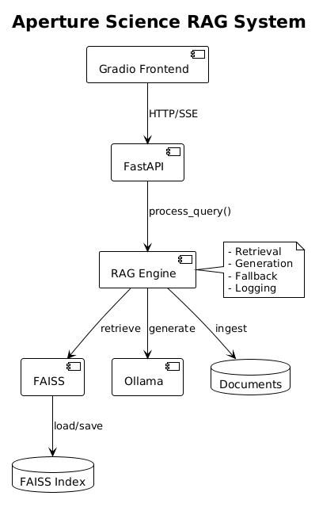

# Aperture Science RAG API

[](https://www.python.org/)
[](https://fastapi.tiangolo.com/)
[](https://ollama.ai/)

## Overview

Retrieval-Augmented Generation API for Aperture Science documentation. FAISS + Ollama embeddings with Llama 3.2 generation. Features fallback guardrail, SSE streaming, and structured logging.

**Stack:** FastAPI, LangChain, FAISS, Ollama, Gradio, Loguru

---

## Architecture



| Component | Implementation |
|-----------|---------------|
| Document Loader | TextLoader, UnstructuredMarkdownLoader, PyPDFLoader |
| Chunker | RecursiveCharacterTextSplitter (chunk=500, overlap=50) |
| Embeddings | Ollama (nomic-embed-text) |
| Vector Store | FAISS (IndexFlatL2) |
| LLM | Ollama (llama3.2:3b, temp=0.1) |
| API | FastAPI |
| UI | Gradio |

---

## Installation

```bash
# Install Ollama
curl -fsSL https://ollama.com/install.sh | sh
ollama pull nomic-embed-text
ollama pull llama3.2:3b

# Setup
python -m venv venv
source venv/bin/activate
pip install -r requirements.txt
cp .env.example .env
```

### Run

```bash
python run.py              # API @ http://localhost:8000
python run_frontend.py     # UI @ http://localhost:7860
```

---

## API Reference

### POST /api/v1/query

**Request:**
```json
{"question": "string", "stream": "boolean (default: false)"}
```

**Response:**
```json
{
  "answer": "string",
  "sources": [{"source": "string", "score": "float"}],
  "confidence": "float",
  "timing": {"retrieval": "float", "generation": "float", "total": "float"},
  "tokens": {"prompt": "int", "completion": "int"},
  "fallback": "boolean"
}
```

**Example:**
```bash
curl -X POST http://localhost:8000/api/v1/query \
  -H "Content-Type: application/json" \
  -d '{"question": "What is the portal gun?"}'
```

### GET /health
```json
{"status": "healthy", "model": "llama3.2:3b"}
```

---

## Streaming (SSE)

**Protocol:** Server-Sent Events (text/event-stream)

```
data: {"chunk": "T"}
data: {"chunk": "h"}
...
data: {"done": true, "metadata": {...}}
```

---

## Core Logic

### RAG Pipeline

```
Query → Safety Check → Retrieve (FAISS) → Threshold Check → Format Context → LLM → Response
```

### Fallback Triggers

| Condition | Response |
|-----------|----------|
| No documents | "No relevant documents found" |
| Confidence < 0.5 | "Insufficient confidence" |
| Injection detected | "Query rejected" |

---

## Performance

| Metric | Average |
|--------|---------|
| Retrieval | 25-50ms |
| Generation | 2-5s |
| Total | 2-5s |
| Tokens/Query | ~800 |

---

## Logging

**Format:** Structured JSON with UNIX timestamps

```json
{"timestamp": 1750341045, "timestamp_human": "20260819_163045", "level": "INFO", "message": "..."}
```

**View:**
```bash
tail -f logs/rag_api_*.json | python -m json.tool
```

---

## Project Structure

```
src/nw_rag/
├── api/routes.py          # Endpoints
├── core/
│   ├── ingestion.py       # Load + chunk
│   └── retrieval.py       # FAISS ops
├── services/
│   ├── rag_engine.py      # RAG logic
│   └── prompts.py         # Templates
├── frontend/app.py        # Gradio UI
├── config.py
├── logging_config.py
└── main.py
```

---

## Testing

```bash
python test_ingestion.py
python test_rag.py
python test_api.py
```

---

## Troubleshooting

```bash
# Model not found
ollama pull llama3.2:3b

# Import errors
export PYTHONPATH="${PYTHONPATH}:/path/to/project/src"

# Rebuild index
rm -rf faiss_index && python test_ingestion.py

# PDF support
pip install pypdf pypdf2
```

---

## Dependencies

```txt
fastapi==0.104.1
uvicorn==0.24.0
langchain==0.3.0
langchain-community==0.3.0
langchain-ollama==0.1.0
faiss-cpu==1.7.4
python-dotenv==1.0.0
pypdf==3.17.4
gradio==4.19.2
loguru==0.7.2
```

---

**Aperture Science** - We do what we must because we can.
